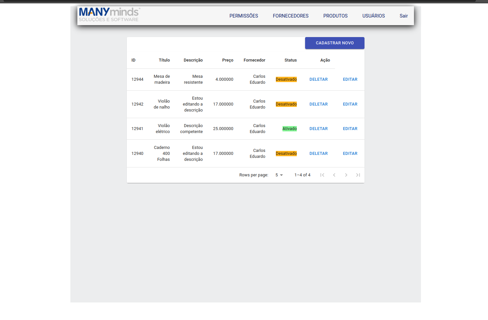
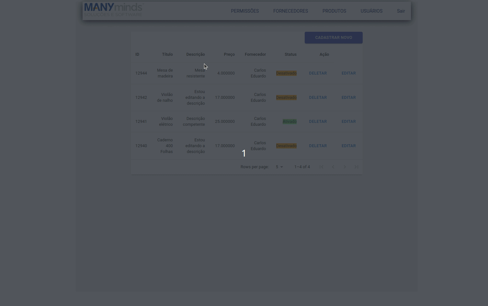

# Front para o projeto de test da Manyminds Soluções e Software.

O objetivo do projeto e receber os dados vindo da API desenvolvida em Codeigniter 3, e popular esses dados no React js, usando bibliotecas como Redux para o gerenciamento global da aplicação.

## Instalação para primeira vez de uso.
Instalar as dependências
> `yarn install` ou `npm install`
## Inicie a aplicação com o comando 

>`yarn start`

* Aqui está algumas fotos das telas

>`Tela de listagem dos produtos`

>`Deseja excluir um produto?`
